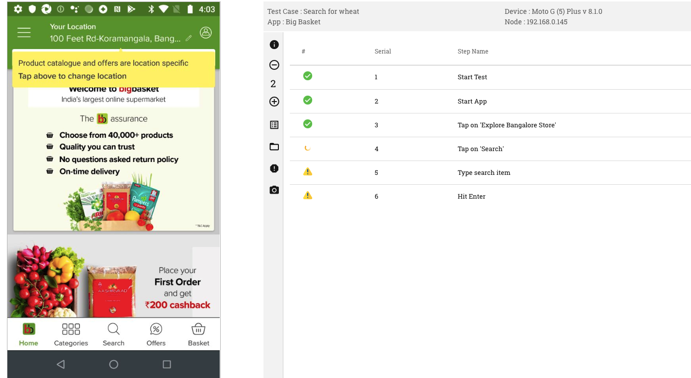

Live View
=========

.. role:: bolditalic
  :class: bolditalic

.. role:: underline
  :class: underline

On the header, in the RobusTest application, you will find a link for Live View.

This page displays a list of all active manual, recording and automation run sessions belonging to the user who has logged in. Even Appium test runs made using RobusTest Hub can be accessed here.

Each session entry provides you information about: 

* the app build being tested
* the device that the app is running on 
* the ADB ID of the device being used
* the type of test session - i.e., Manual, automation or test run
* the user who has started the test
* the date and time of commencement of the test session

 .. image:: _static/liveviewsessions.png

In addition to the above info, you will also find the following buttons:-

* :bolditalic:`Live Screen button` 

   * You can view the live screen of a device currently being used by the user by cicking on this button (i.e., the monitor icon). 
   * A new window will open with the screen of the device. In case of a test run, one can also see the test steps on the live screen. 
   * To be able to control the device screen during a test run session, append the following to the live screen URL: **?deviceControl=true**

* :bolditalic:`Resume Session`  

   * This button is denoted by a green coloured 'Play' button icon on the live sesssion entry. 
   * It comes in handy when you have accidentally closed the browser tab on which your Manual or Automation test session is running. Now, on clicking this button, you can resume your Manual or Automation test session. 

* :bolditalic:`Release Device` 
   
   * You can end an active manual test or test recording session from this page by clicking on the this button. 
   * This frees up the device for a new test session.

**View multiple device screens in parallel**

On the Live View Sessions page, you also have the option to view multiple device screens at the same time on your monitor. 

For this:-

  **1.** enable the check box at the left side of each live view session entry, whose device screens you would like to view. At least two live session entries should be selected

  **2.** Click on the 'Start Multiplexing' button

  **3.** The user can now view the selected devices in Multi-device mode
