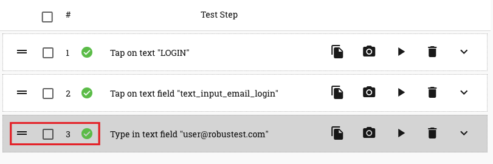

.. _manage-testcases:

Creating and Managing Test Cases
================================

.. role:: bolditalic
  :class: bolditalic

.. role:: underline
  :class: underline

On the top right corner of your Automation session, you will see a group of buttons that help you manage your test cases

Let's go through each of them

* :bolditalic:`Import test case` - You can import an existing test case into an automation test session by clicking on this button.

   * On clicking on the 'Import test case button', a window pops up with a list of all test cases being displayed.
   * Click on the test case you want to import and then click on the 'Save' button
   * The test case is now seen loaded into the test session. You can now execute test steps in the test case

* :bolditalic:`Remove imported test case` - Let's say you imported a test case, worked on it and updated it. Now you would like to create a new test case afresh. How do you clear the test step table?

You can do so by clicking on the 'Remove imported test case' button. This removes the test case from the test session and clears the test step table. You can now go ahead and start recording a new test case.

This button will be visible only after an existing test case has been imported or a new test case is created & saved.

* :bolditalic:`Update test case` - Sometimes you may want to update an existing test case. In such cases, you first import the test case into a test session and then proceed to make the necessary changes.

Once your changes are complete, click on the 'Update test case' button. An 'Update test case' window pops up.

You can choose to modify the name or description of the test case on this window. 

You also have the option to add tags to mark the test case. E.g. Smoke, Regression, Login, Payments, etc.

To create a tag:
   * Enter a tag name on the 'Test case tag' field
   * Hit 'Enter'. The tag is now created

Now click on the 'Update' button to save the changes made to the test case.

This button will be visible only after an existing test case has been imported or a new test case is created & saved.

* :bolditalic:`Save new test case` - You can save a newly created automation test case clicking on this button.

If you have imported an existing test case, then, on clicking on the 'Save new test case' button, you can save this test case with a new name and create a new test case. The originally imported test case remains the same as it were.

