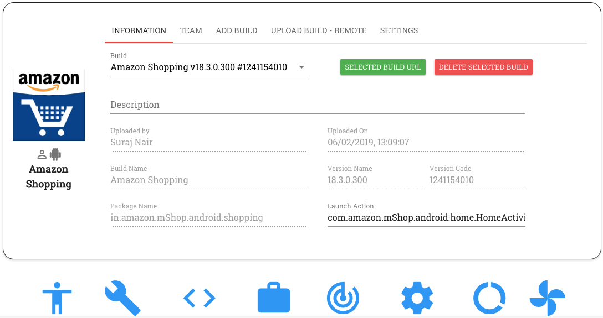

Project Dashboard
=================

.. role:: bolditalic
  :class: bolditalic

.. role:: underline
  :class: underline

.. |br| raw:: html

     

The Project Dashboard provides you information about the project you have created - i.e., the app under test, the build details, project members, CI settings, etc.

Let's have a look at the Dashboard in detail.

The Project Dashboard constitiyes of the following 4 sections:

1. Builds
2. Team
3. Upload Build - Remote
4. Settings

**1. Builds**

This is the section of the Dashboard on which you land by default on clicking on a project.

The Build section provides you information about:

* *Build details* (i.e., build name, version name, version code, package name and launch action)
* *Description about the build*
* *Build file size*
* *Name of the team member who uploaded the build to the project*
* *Date of upload of the build to the project*

You can upload multiple builds to a project. You can choose the build to be tested upon from the 'Build' drop down field.

In addition to providing you the details about the build, this section of the Dashboard also allows you to perform the following tasks:

* :bolditalic:`Upload New Build` - Clicking on this button enables you to manually upload an app build from a chosen location to the project
* :bolditalic:`Get selected Build URL` - Clicking on this button copies to the clipboard, the URL to download the currently selected build in the project. On pasting this URL on a browsr tab and hitting enter, the user is able to download the currently selected build onto their computer.
* :bolditalic:`Delete Selected Build` - Clicking on this button deletes the currently selected build from the project. Only a project member with admin privileges can delete a build.

**2. Team**

All members who are added to the project are listed on the Team setion. Apps that are part of a particular project can be accessed by everyone who is part of that project.

Project members have the ability to test, automate and view reports for any build that is part of their project.

Each team has 2 kinds of memebers - Admin and non-admin

Admin members have a few additonal privileges when compared to non-admin members. They can:-

* Delete a build from the project
* Add/remove members from the project
* Grant to/Revoke from a team member admin privileges
* Execute a CURL command to upload an app build remotely

By default, a member who creates a project has admin privileges on that project.

**Note:** :bolditalic:`An Admin member of a project is different from a RobusTest Admin` The former's privileges are restricted to the project the member is a part of while the latter has special prvileges on the entire RobusTest platform

**3. Upload Build - Remote**

This section is visible only to admin members of the project.

Here, a CURL command is provided which enables the user to upload an app build to the current project remotely

The general format of this command is as follows::

   curl -X PUT '<RobusTest URL>/v3/project/<PROJECT IDENTIFIER>/build?accesskey=<USER ACCESS KEY>' -H 'content-Type: multipart/form-data' -F build=@<BUILD NAME WITH PATH> -F  buildInfo='{"desc":"<build description>", "label":"<label>","activityClass":"<launch actvity>"}'

Let's break down the different components of this command for better understanding:

* **RobusTest URL**: This refers to the URL that you use to access the RobusTest platform. It would be of the form *http://'<RobusTest IP>'* or *http://'<RobusTest domain>'* E.g. http://robustest.this.instance.com:8085
  |br|
* **PROJECT IDENTIFIER**: The 'Project Identifier' is how we identify the project to which we want to upload the new app build. This can be obatined as follows:
  
  * On RobusTest, go to the Project Dashboard of the project to which the build is to be uploaded

  * The URL displayed there is of the form *<RobusTest IP>/#/project/<Project ID>/dashboard* 

  * Copy the *Project ID* value from above URL

  * E.g. if the URL says *http://robustest.this.intance.com:8085/#/project/5d176ffef0238be8f3b7afa5/dashboard* , then, the value *5d176ffef0238be8f3b7afa5* above, is your project ID

* **USER ACCESS KEY**: Each user has a unique User Access Key associated with their profile on RobusTest. 

  By default, the user access key will be populated in the 'Remote build upload' command provided on the Project Dashboard. All builds will be uploaded using the RobusTest ID of the team member whose access key is being used.

  Later, if you would like to upload the build using a different team member's RobusTest ID, you need to change the value of the 'User Access Key' in the 'remote build upload' command.

  Please have a look at the :ref:`user-profile` page for more details on how to obtain the *User Access Key*. 

* **BUILD NAME WITH PATH**: The path to the location from where the build can be picked is specified here. The app build present in the location  or path mentioned in the command is uploaded to the project that is identified by the Project Idenitifier.

* **buildINFO section**: This section is used to provide additional details about the build such as description, label or launch activity. It is not mandatory.

A sample remote build upload command would look as follows::

   curl -X PUT 'http://robustest.this.instance.com:8085/v3/project/5d176ffef0238be8f3b7afa5/build?accesskey=aY33cDmkt7B2nAjxBl6Tp2FWv4' -H 'content-Type: multipart/form-data' -F build=@/username/build/new/latestbuild.apk -F  buildInfo='{"desc":"description from api"}'

You can now run the above command directly on the Command Line OR choose to invoke this build-upload API through a programming script in a language of your choice.

E.g. you can add the above line to your Jenkins shell script that creates a new build. As a result, whenever a new build gets created, it also gets uploaded to the project. Using RobusTest, you can now build a process, say, to test this new build by running a sanity or smoke test each time a new build is uploaded to the project.

**4. Settings**

This section provides you the following options:

**a.** :bolditalic:`Enable notifications` - On enabling this checkbox, each member of the team is notified whenever a new build is uploaded to the project

**b.** :bolditalic:`Choose Bug Tracker configuration` - RobusTest supports Continuous Integration with your existing CI tools through APIs. 

Once you have integrated your Bug Tracker tool wih RobusTest, this configuration will be available for selection in the 'Bug Tracker' drop down. Once the required configuration is selected, all bugs encountered during your testing can be logged directly, from RobusTest, into the tool of your choice.

You can configure your project with the tool of your choice through the 'Integration' section of the RobueTest Admin Console.