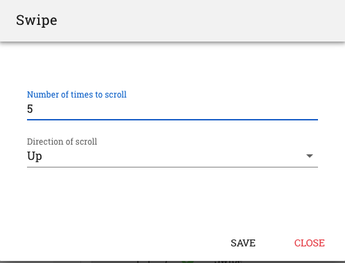

.. _swipe-on-page:

Swipe
=====

Recording a 'Swipe' action on RobusTest essentially consists of providing two parameters:

1. the *direction* is which you want to swipe; and;
2. the *number of times* you want to perform the swipe action

RobusTest provides you two ways of recording a swipe action. These are:

1. Swipe
2. Swipe Till

Both the above options can be seen on the context menu that opens up on executing a left-click with your mouse on the device screen.

Let's have a look at the difference between these two.

**1. Swipe**

This option allows you to record a swipe from any point on the page for the number of times that you specify. It is not dependent on any element present on the page. It just executes the 'Swipe' action.

  **a.** *Hover the mouse over *any* element on the app screen so that it is highlighted by a rectangle.*

  **b.** *Left-click on the element and select the 'Swipe' option on the context menu.*

  **c.** *Ensure that you have provided the correct values for 'direction' and 'number of times to scroll' on the pop-up window that opens up*

  **d.** *Click on the 'Save' button. A swipe test step is now created*

**2. Swipe Till**

You can use this option to scroll down until a specific element on the app page is arrived at. 

  **a.** *Switch to Manual mode in the Automation test session*

  **b.** *Manually scroll until you arrive at the element till which you would like to scroll*

  **c.** *Switch back to Automation mode*

  **d.** *Hover the mouse over the above element so that it is highlighted by a rectangle*

  **e.** *Left-click on the element and select the 'Swipe Till' option on the context menu*

  **f.** *Ensure that you have provided the correct values for  'direction' and 'number of times to scroll' on the pop-up window that opens up*

  **g.** *Click on the 'Save' button. A swipe test step is now created*

If the element specified is not present OR if it is not arrived at on the page within the number of scroll tries specified, then an error message is displayed.
