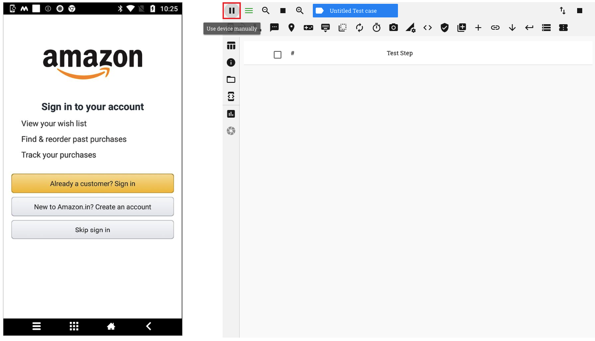
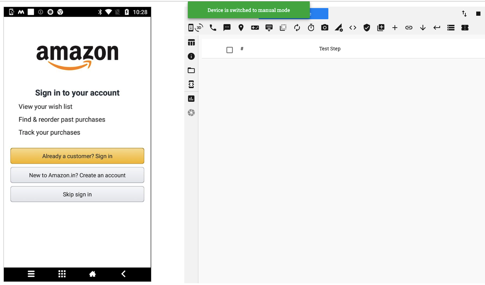
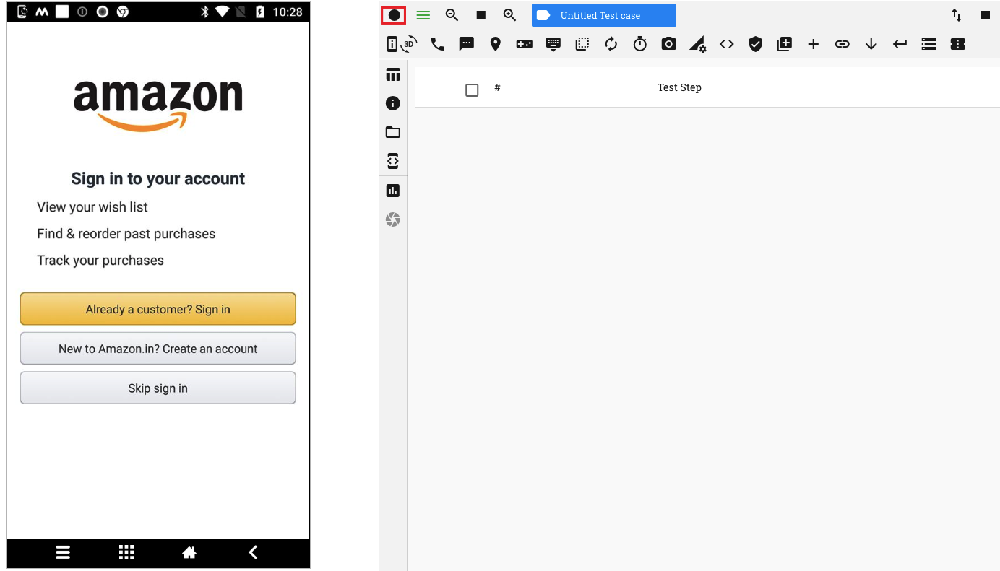
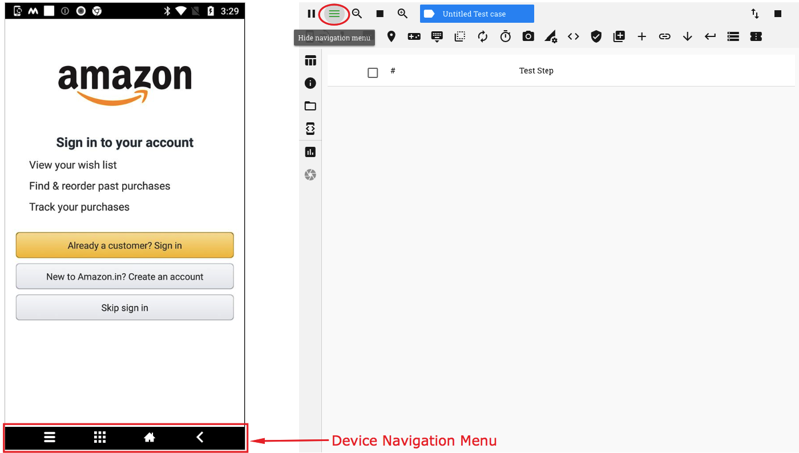
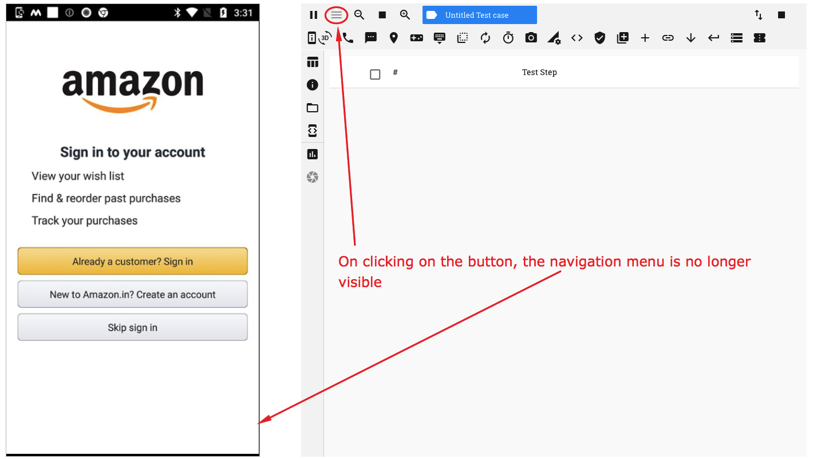
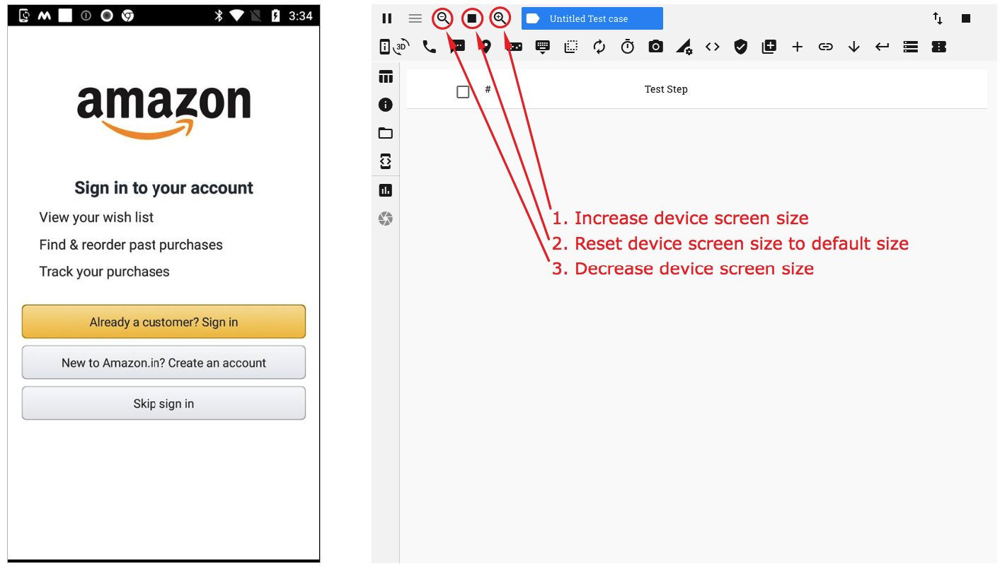
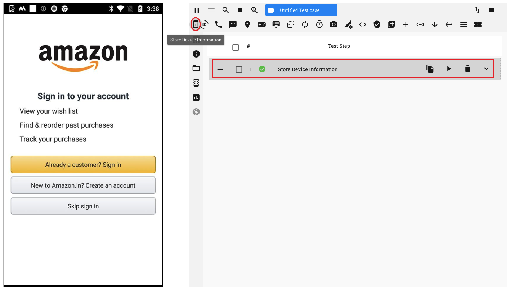
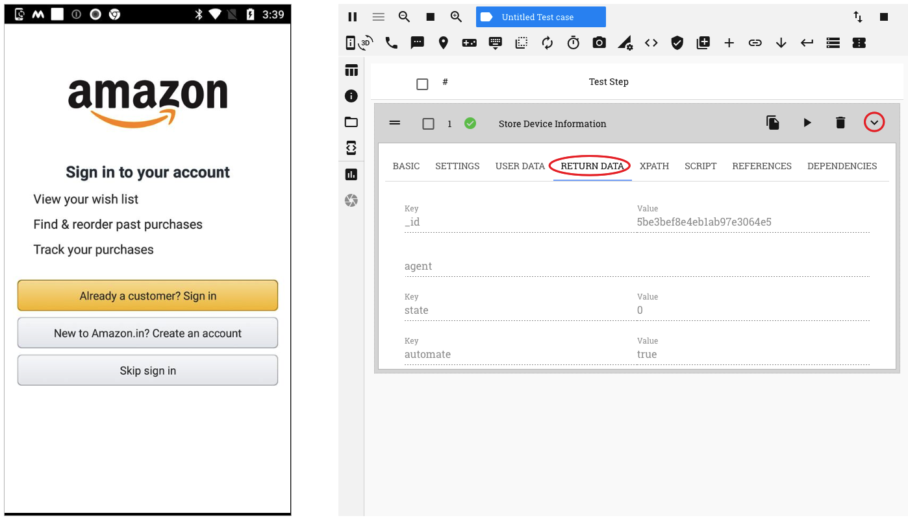
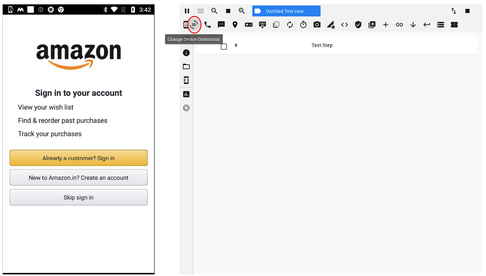

.. _test-session-device-management:

Test Session - Device Management
================================

.. role:: bolditalic
  :class: bolditalic

.. role:: underline
  :class: underline

**1. Pause/Resume Automation session**

While in an automation test session, you may, at times, choose/need to access the device in Manual mode.

You may toggle between Automation and Manual test modes by clicking on the 'Pause/Resume' button

On clicking the 'Pause' button, the device is switched to Manual mode and a corresponding message is displayed. You can now access the device screen directly as if you were aceessing it manually

You can see that the icon for the button has now changed. On clicking on the 'Resume' button, the device is switched to automation mode

**2. Show/Hide Navigation Menu**

RobusTest provides you a device navigation menu on the device screen when in Automation mode

On clicking the 'Hide Navigation Menu' button, the menu is no longer displayed on the device screen. Clicking on this button again, enables the menu.

On starting an automation test session, by default, the navigation menu is enabled

**3. Increase/Decrease device screen size**

You can manipulate the size of the device screen by using the resizing buttons on the horizontal menu, as shown in the screenshot below

**4. Capture device information**

Information about the device can be captured by clicking on the 'Store device information' button. On clicking this button, a test step is seen to be recorded

Now, expand the test step and click on the 'Return Data' tab. All information about the device can be viewed on this tab. You can scroll down to see more information

**5. Change Device Orientation**

You can toggle between the Landscape and Portrait modes by clicking on the 'Change Device Orientation' button

To change  to Landscape mode:
    1. Click on the 'Change Device Orientation' button
    2. Choose 90 degrees on the pop up window
    3. Click on the 'Save' button

.. image:: _static/changeorientation2.png

<Add image of device screen in Landscape mode here>

**6. Location Simulation**

This feature allows you to test as if the device is present at a different location than where it actually is. This is done by  simulating the location on the device.

:bolditalic:`Pre-requisites:`

  On the device:

    1. in Developer options:
       * enable 'Mock Locations'
       * set the Nizedha app as your mock location app
    2. in 'Locations', set the 'Location Mode' to 'Device only'

Once the pre-requisites have been met, you can simulate any location as follows:

 1. Click on the 'Set Location' button on the header
 2. Type the name of the location in the 'Search location here' field and select from the drop down. Alternatively, you can manually pin the location of your choice on the map
 3. Once your location has been pinned, click on the 'Set Location' button

Your device will now behave as if it is situated at the location chosen by you.

A corresponding 'Set Location' test step is seen created in the test step table. 

You can change the location setting by modifying the latitude and longitude values specified in the 'User Data' section of the recorded test step.

