.. _test-session-testcase-management:

Test Session - Test Case Management
===================================

**1. Call a phone number**

Under Construction

**2. Read OTP from phone**

Under Construction

**3. Send Instruction to device**

At times, you may want to execute commands through the device keyboard. You can use the 'Send Instruction to device' button to execute actions performed on the device keyboard.

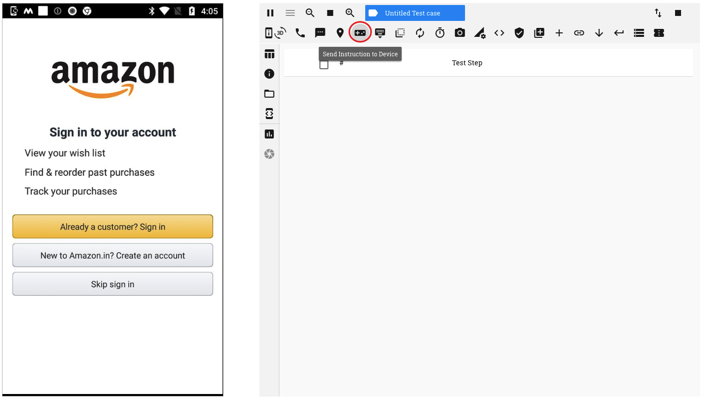

**4. Hide keyboard if displayed**

Clicking on the 'Hide Keyboard' button, minimizes the device keyboard that is open on the app

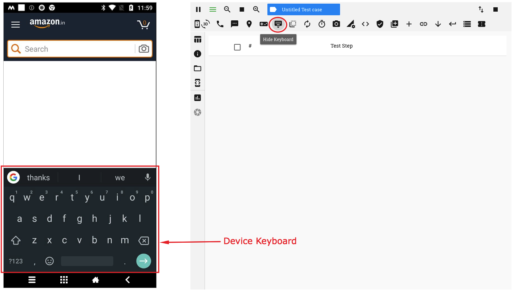

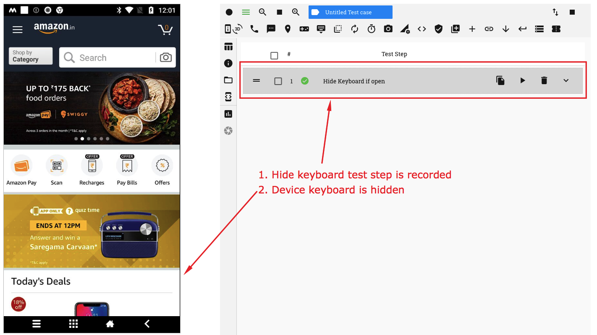

**5. Send app to background for 10 secs**

The 'Send App to background' button, enables you to send the app into the background for a specified duration. 

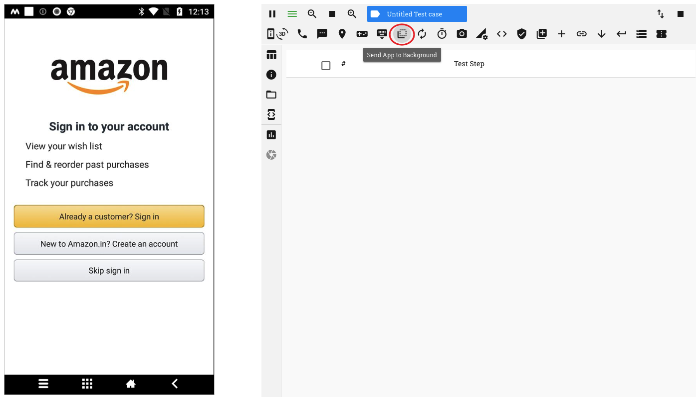

If the 'Resume mobile app' option is selected, the app is brought back to the forefront at the end of the duration

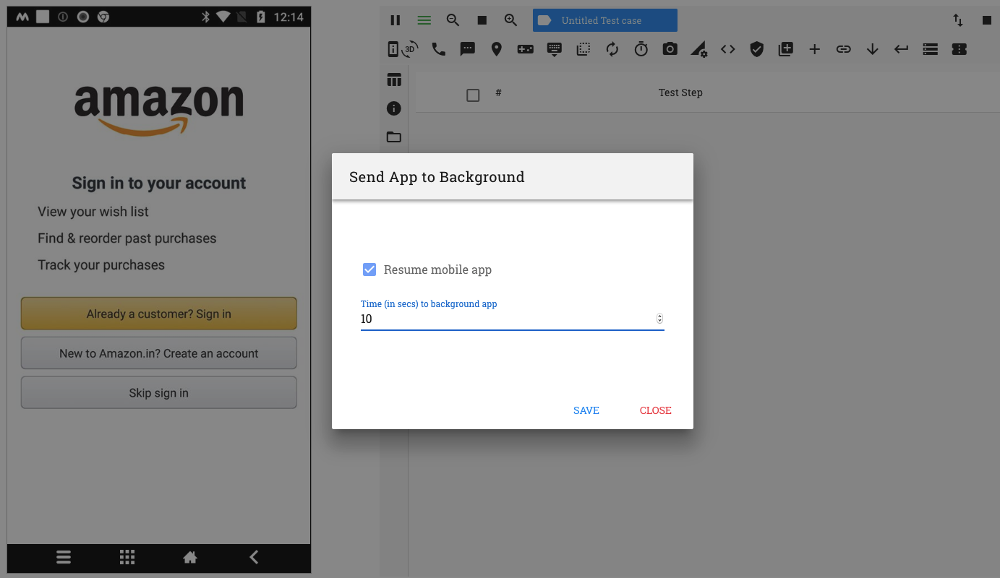

**6. Reset app and clear user data**

On clicking on the 'Reset app and clear user data' button, all data related to the app that has been cached is cleared and the app is then relaunched. The app then behaves as if it has been launched for the first time

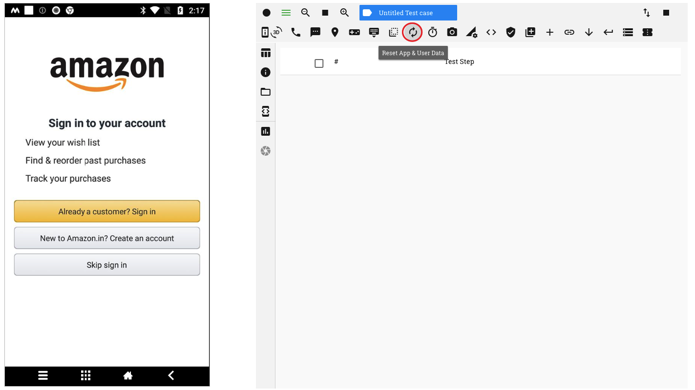

**7. Pause Test Execution**

You can add a pause time or a wait period after a test step by clicking on the 'Pause test execution' button

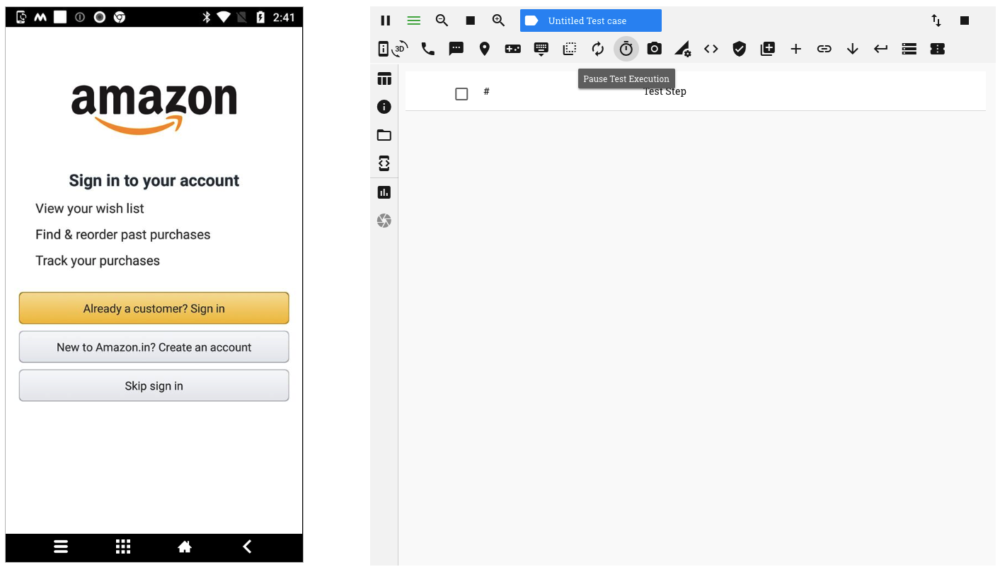

You can provide a duration (in seconds) for which test execution will be paused

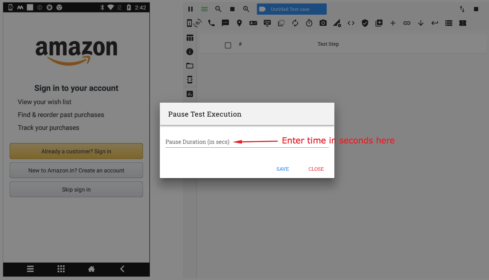

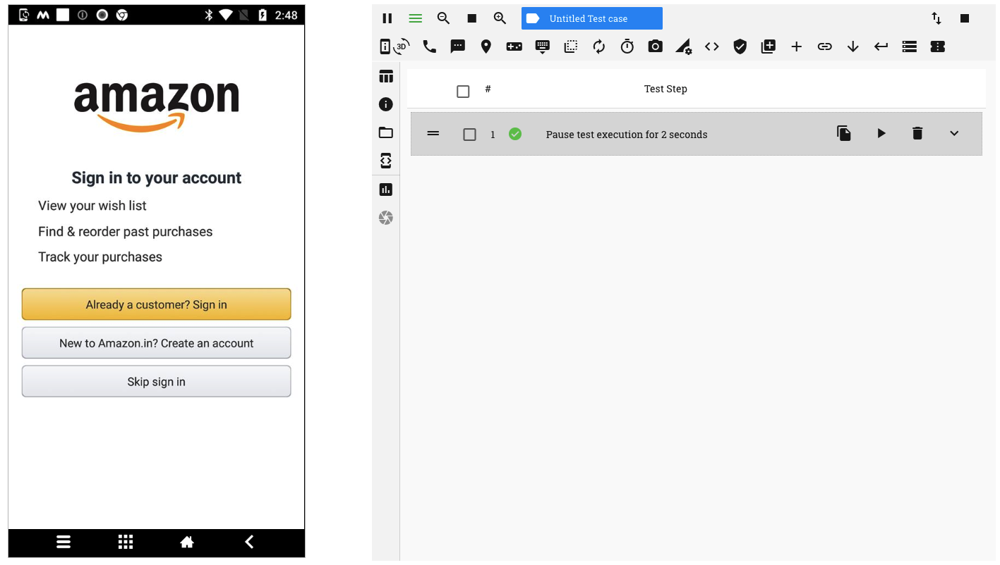

**8. Capture device screenshot**

You can record a test step to capture a screenshot of the device screen at any point during the execution of a test case. This can be done by clicking on the 'Capture Device Screen' button

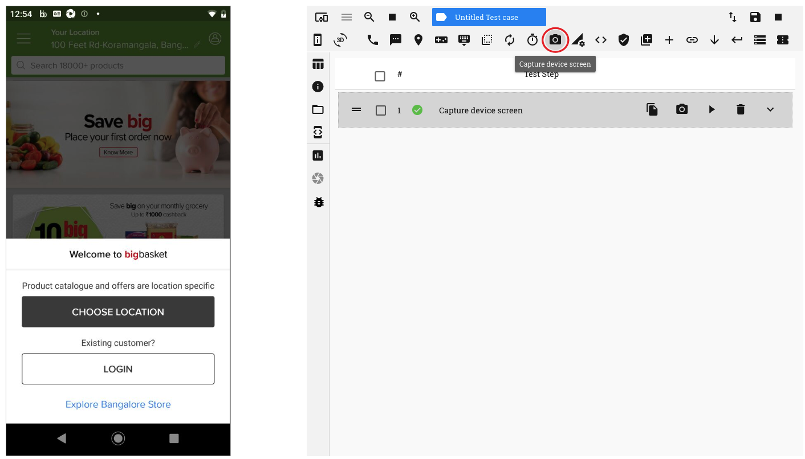

When this test step is executed in a test run, the screenshot captured is available in the functional reports

**9. Configure Device Network**

RobusTest provides you an option to choose a network configuration on your device as part of your test case.

To do so, click on the 'Configure Device Network' button

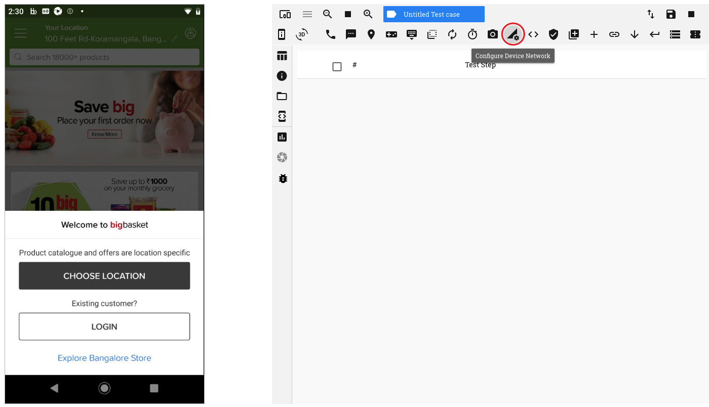

On Clicking on this button, a pop-up window opens from which you may select one of the following options:

1. No Connection    - This disables both Wifi and Mobile Data networks on the device
2. Airplane Mode    - This enables Airplane mode on the device
3. Wifi Only        - This enables Wifi network on the device
4. Data Only        - This enables the Mobile Data network on the device
5. All Networks On  - This enables both Wifi and Mobile Data networks on the device

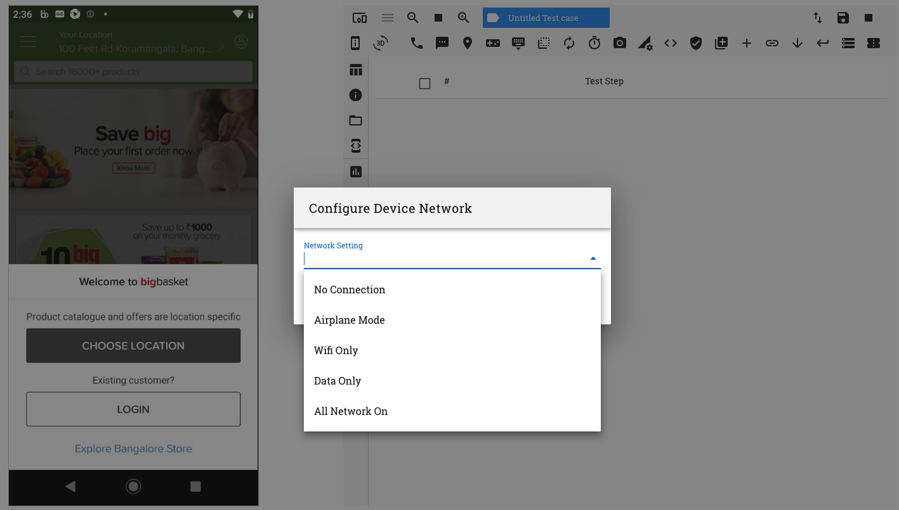

Once an option is selected, a test step is created to enable/disable the selected option

**10. Execute ADB command**

**11. Verification**

Check out the :ref:`verification-global` page to understand this functionality

**12. Execute REST API**

RobusTest enables you to record test steps to make REST API calls. You can then check the response of these calls for later verification.

  1. On clicking on the 'Execute REST API' button, a window pops up

  .. image:: _static/executerestapi.png

  2. On the pop-up window, there are 3 secions available:

     a. Basic
        * Provide the REST API and the Request Type (i.e., GET, POST, DELETE, etc) here
        * If required provide a timeout for the API call
     b. Authorization
        * You can specify the type of Authorization to be used for the API and provide appropriate credential values as required. E.g. For Basic Authorization you need to provide the username and password.
     c. Header
        * Specify in this section any additional parameters that need to be passed as part of the REST API call

  3. Provide details to invoke the REST API and click on the 'SAVE' button.

  4. A test step corresponding to the invoking of the API is now seen created.

  5. The response of the API call can be seen in the 'Return Data' section of the test step. These values can be used for verification.

**13. Import Function**

User can import functions created by clicking on the 'Import Function' button

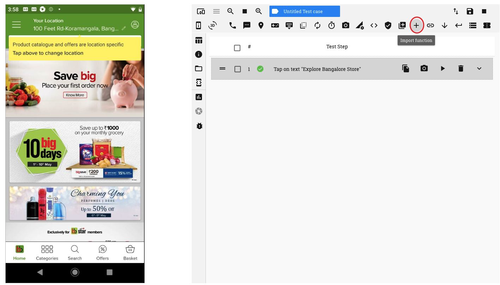

On the window that pops up, a list of functions is displayed. Click on the required function and click on the 'Save' button.

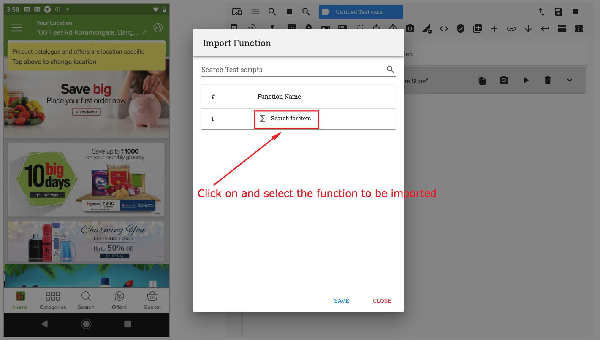

The function is now seen in a test step as part of the test case
 
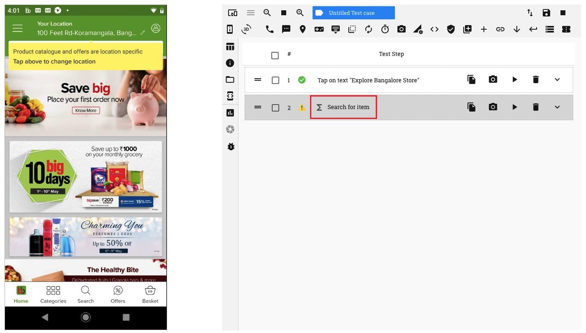

**14. Execute Deeplink**

You can use this functionality to rcord a test step to execute a deeplink in your app. For this, provide the deeplink URL (and a Package name, if required) and click on the 'Save' button.

**15. Get Current Context**

**16. Set Current Context**

**17. Execute Database calls**

Clicking on this button enables you to execute Database queries.

   .. image:: _static/executedbquery.png

  1. On the 'Execute DB Query' window that opens, enter the following information:
     
     * *DB Provider* - Presently we support Oracle

     * *Connection String* - This should be in the format: *username/password@db_host:port/db_name* 

     * *DB Query* - provide the database query to be executed

     * *Result Row*

  2. Click on the 'Save' button to execute the query

  3. A corresponding test step is created in the test step table. The output of the query is viisble in the 'Return Data' section of the test step.

**18. Manage Android Permission Alerts**

On Android version 6.0 and later, Android provides the user the option to '*Allow*' or '*Deny*' different kinds of permissions to an app on the user's mobile device. These include permissions to access 'Contacts', make phone calls, send SMS, access location, etc.

On RobusTest, after you have started an automation test session for an app, if Android Permission Alerts pop-up, then, *the default way of handling these alerts is to 'Allow' all such requests*. 

No test steps are created for the handling of these alerts.

However, RobusTest provides you a highly customisable way to handle these permissions too.

  1. Click on the '*Manage Android Permission Alerts*' button on the header

    .. image:: _static/managepermissionalerts.png

  2. On the pop window that opens, you have the following options:

     * *Auto - Allow All Alerts*: This is the default option on RobusTest. If this option is selected, then the '*Allow*' button is clicked on for all Android Permission Alerts that pop up. 

     These alerts are handled automatically. No test step is created for the same.

     * *Auto - Deny All Alerts*: If this option is selected, then the '*Deny*' button is clicked on for all Android Permission Alerts that pop up. 

     These alerts are handled automatically. No test step is created for the same.

     * *Handle in test case*: If this option is selected, then the user is provided the flexibility to determine how each permission alert is to be handled. 

     For each Android Permission Alert that pops up, you can choose to click either on the '*Allow*' button or on the '*Deny*' button. 

     A corresponding test step is created for the same. This will be a part of the test case.