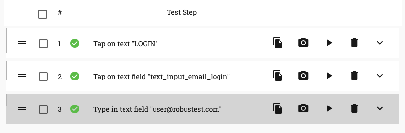
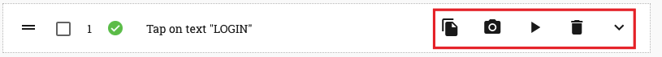
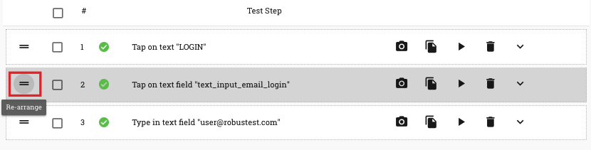
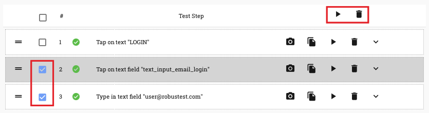

.. _teststep-management:

Test Step Management
====================

For each action you record on the app, a corresponding test step is created in the 'test step table' to the right of the device screen

As you can see, RobusTest provides a default test step name for each test step by attempting to identify the user action. You can customise the name as required (more on this later).

Let's have a look at the different operations available to the user to perform on a test step

The icons to the right side of the test step relate to actions you can perform on that specific test step (see screenshot below)

* *Copy step* - this enables you to create a duplicate test step performing the same action as the original test step. This saves you time taken in re-recording the same test step , when you have to repeatedly perform the same action in the test case

* *Update Screenshot* - when you first record a test step, RobusTest captures a screenshot of the app page as it was at that moment. If you feel that this screenshot does not adequately represent the test step that was recorded (say, because the page took too long to load), then you can use the 'Update Screenshot' button to capture a new screenshot. 

The screenshot that is thus captured is displayed as the 'Original' screenshot in your run report when you execute the test case as part of a test run. 

* *Play step* - this enables you to execute the test step while in the Automation test session 

* *Delete step* - this enables you to delete the test step that you have recorded

* *Show step details*  - clicking on this expands the test step to reveal more options. You can know more by clicking on :ref:`test-step-details`

The icons to the left side of the test step relate to actions you can perform on one or more test steps (see screenshot below)

.. image:: _static/teststep3.png

* *Re-arrange icon* - this icon helps in two ways: 
      a. By pressing and holding the mouse pointer over this icon and then dragging it, the user can re-arrange the position of this specific test step within the test case.

      b. By clicking on this icon, the user can pin the test step. This means that any new test step that is now recorded will be positioned after the pinned test step. 

* *Checkbox to select test step* - when the checkbox on a test step is selected, two more buttons become at the top of the Test Step table - 'Group Play' button and the 'Group Delete' button

   * *Group Play button* - when this button is clicked, all test steps in the test case, that have been selected by enabling the checkbox on the test step, are executed in the order in which they are present in the test case.

   * *Group Delete button* - when this button is clicked, all test steps in the test case, that have been selected by enabling the checkbox on the test step, are deleted in the order in which they are present in the test case.

* *Test step execution status* -  this icon indicates the status after execution of the test step.

