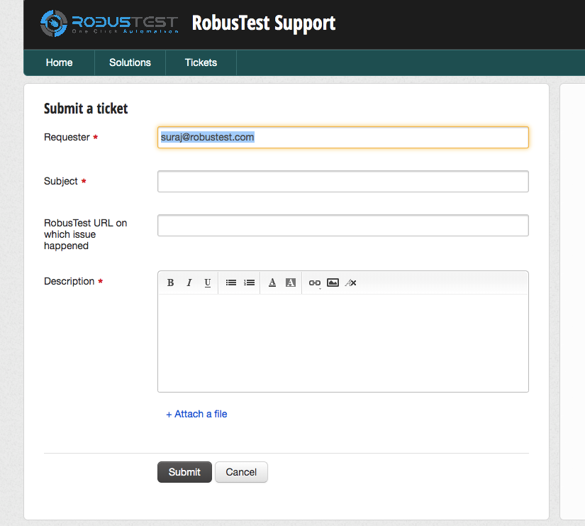

.. _user-profile:

User Profile
============

On the top right corner of the RobusTest page, you see your RobusTest username being displayed.

On clicking on the username, a menu with the following options is displayed:

1. Profile
2. Help
3. Support
4. Logout

**1. Profile**

Clicking on 'Profile' opens the 'User Selection Profile' window.

On this window, the following information are displayed:

   a. *Name*: The username that was used at the time of creation of the profile is displayed here. This field is editable.

   b. *Email*: The email provided at the time of creation of the profile is displayed here. This value is not editable.

   c. *Access Key*: RobusTest provides a number of APIs that you can use to perform a wide variety of actions. For security reasons, only authorized users are permitted to execute these APIs. 

    For this, RobusTest provides each user an access key.  This access key is a unique identifier associated with the user's profile on RobusTest. You will need this access key to execute RobusTest APIs.

    * *Copy Access Key*: This button copies the access key to the clipboard
    * *Hide/Show Access Key*: This button hides or unhides the Access Key that is displayed on the profile
    * *Reset Access Key*: Clicking on this button resets the Access Key. A new Access Key will now be generated for the user

**2. Help**

Clicking on '*Help*' opens the RobusTest Product Documentation page on a new browser tab. The documentation will help you in understanding in detail how the RobusTest platform works.

**3. Support**

At RobusTest, we aim to provide you, the users of our platform, technical support of the highest qulaity. 

When you have a query, you can reach out to us using the '*Support*' option.

On clicking on '*Support*', you will be re-directed to the third-party ticketing platform that we employ to handle all support requests.

On this page, you can provide an appropriate subject line and a detailed description of the issue you are facing or a requirement you would like to be met by the platform. You can also attach relevant screenshots or log files where necessary

Once a support ticket is logged, the RobusTest Support team will respond to your email based on agreed upon service guidelines.

**4. Logout**

You can log out of the RobusTest platform by clicking on the '*Logout*' option
