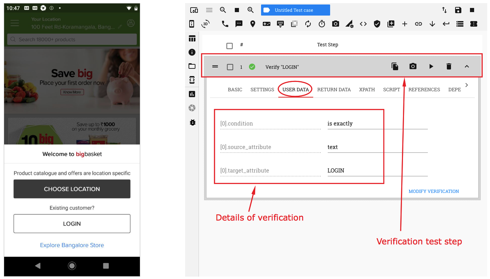

.. _verification-main-page:

Verification
============

.. toctree::
   :maxdepth: 2
   :hidden:

   verifyelement
   verificationglobal
   verifyelementexists
   invertverification

.. role:: bolditalic
   :class: bolditalic

.. role:: underline
    :class: underline

RobusTest provides you a means to compare attribute values of an element with:-

a. a custom value ; Or;
b. that of the attribute value of another element

We refer to this process as a **verification**

A verification is done by comparing a **'Source'** attribute value with a **'Target'** attribute value.

When a verification is recorded, a corresponding test step is created.

Details of the verification can be seen in the 'User Data' section of the verification test step that is recorded.

On RobusTest, a verification can be done in two ways:-

1. :ref:`verify-element`

2. :ref:`verification-global`

The 'Verification' feature on RobusTest provides you a powerful way to perform a many more operations such as:-

1. :ref:`verify-element-exists`
2. :ref:`invert-verification`
3. :ref:`image-based-verification`

