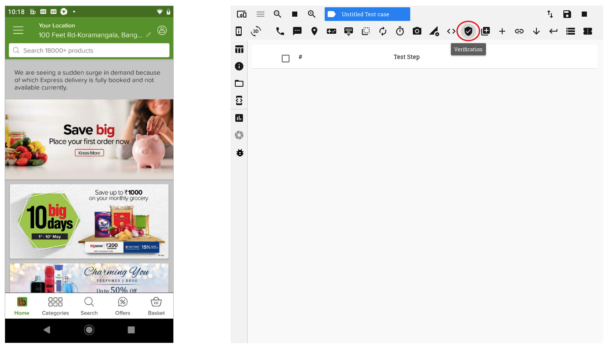
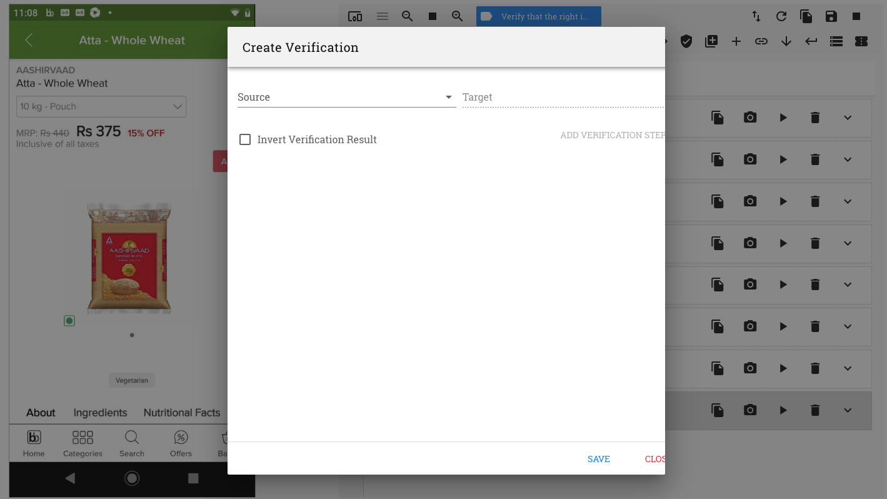
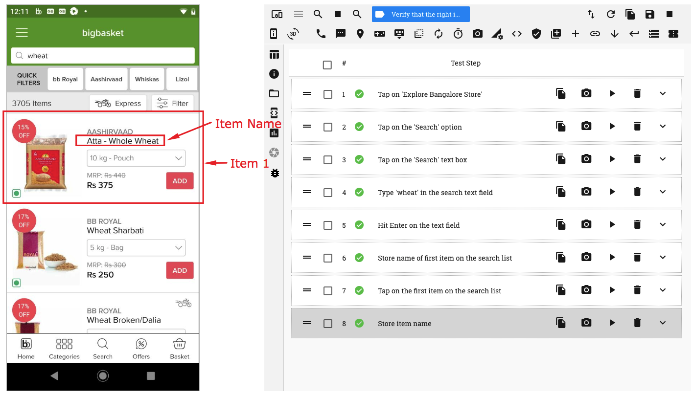
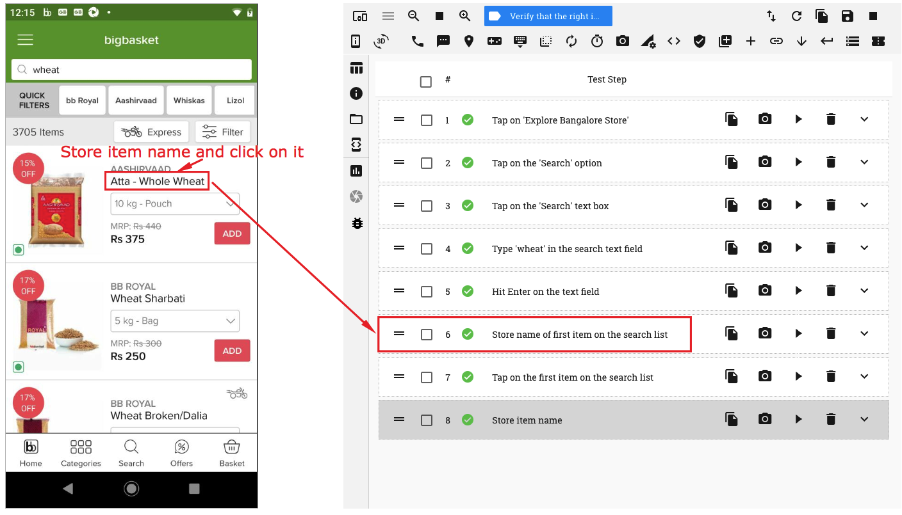
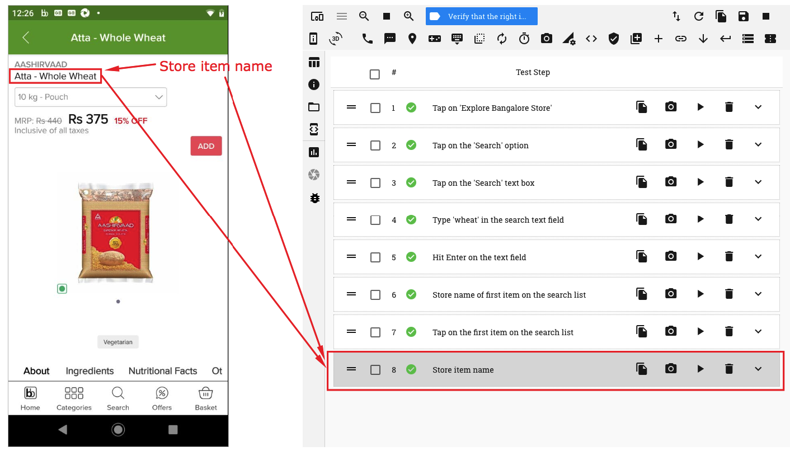
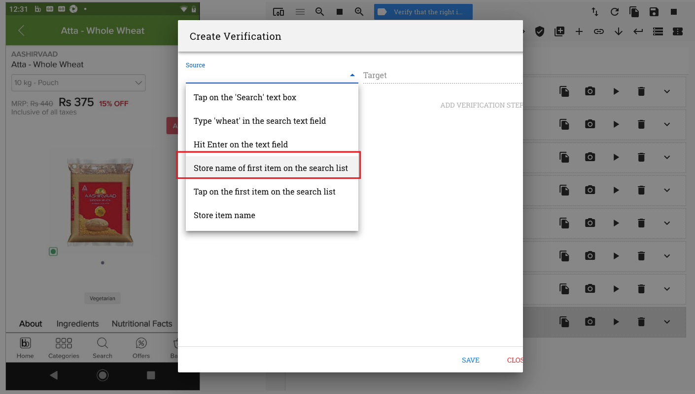
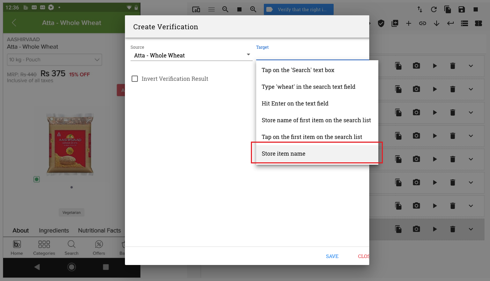
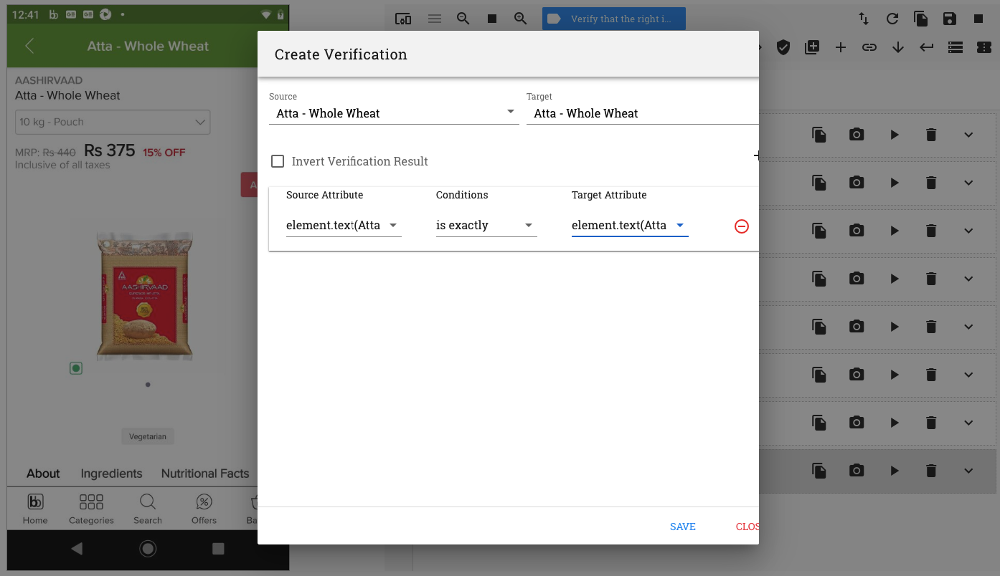
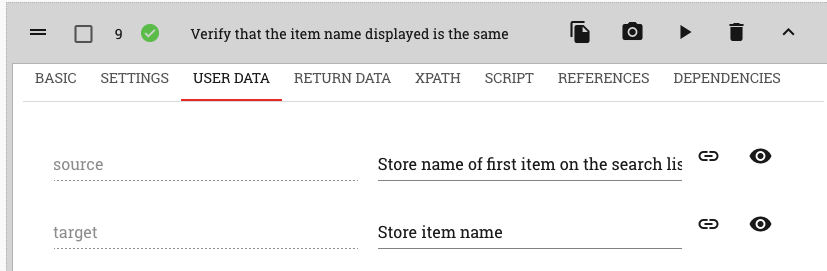
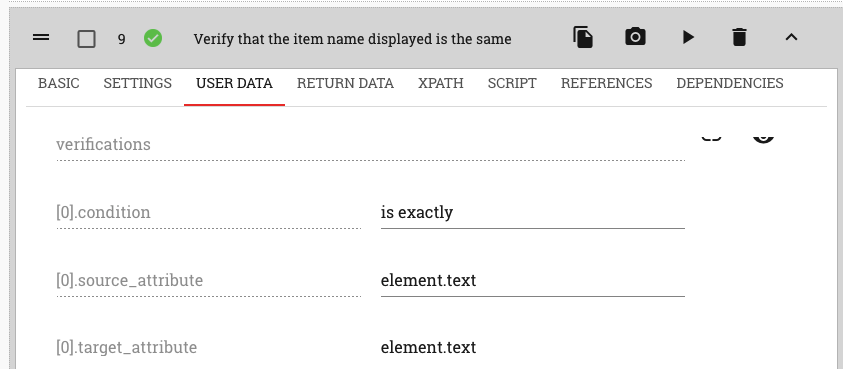

.. _verification-global:

Using the 'Verification' button option
======================================

.. role:: bolditalic
   :class: bolditalic 

.. role:: underline
    :class: underline

The second way in which a verification step can be recorded is by clicking on the 'Verification' button on the top horizontal menu

:bolditalic:`This method is used when the attribute values of two different test steps are to be compared with one another.`

   

On clicking on this button, the 'Create Verification' pop up window comes up

In this case, both the Source and Target elements to be used for comparison have to be selected from their respective dropdowns

A point to be kept in mind is that in order to do a comparison, it is imperative that **the test steps selected in the two drop downs are both 'Store' test steps**

Hence, a 'Store Element' action should be performed on both, the Source and Target elements that are to be compared

The details of the attribute values available for comparison may be viewed in the 'Return Data' section of the two 'Store Element' test steps that are recorded

Let us look at an example to understand this method of verification

E.g. Let us say, we are on an app page where a list of items are being displayed. We need to verify that the name of the first item on the list is displayed correctly if we go to the item's product page by clicking on it

   
Perform a 'Store Element' action on the item name. A store test step is seen recorded.
Now click on the item name to go to the product page

On the Product page, perform a 'Store Element' action on the item name

Now, click on the 'Verification' button on the horizontal menu bar at the top. A 'Create Verification' window opens up

On the 'Create Verification' window, click on the 'Source' drop down and select the first 'Store' test step, i.e., the one where details of the item name of the first item in the list are stored

On the 'Target' drop down. select the second 'Store' test step, i.e, the one where the details of the item name on the product page are stored.

Click on the 'Add Verificaiton Step' button. A verification row is seen created.

On the verification row, select the source and target attributes as well as the condition to be evaluated.

In this example, we will select the Source 'text' attribute and the Target 'text' attribute. We will also select the condition 'is exactly'. 

   
Now click on the 'Save' button. A verification test step is recorded.

Details of the verification condition can be seen in the 'User Data' section of this test step

