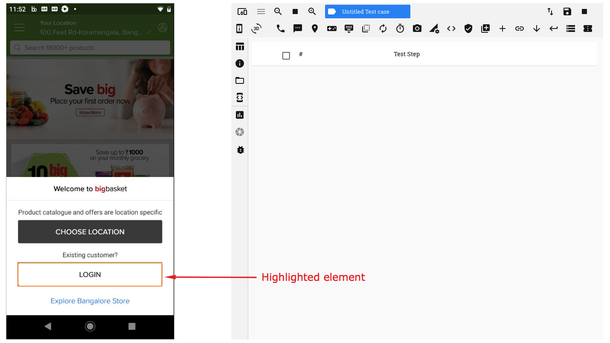
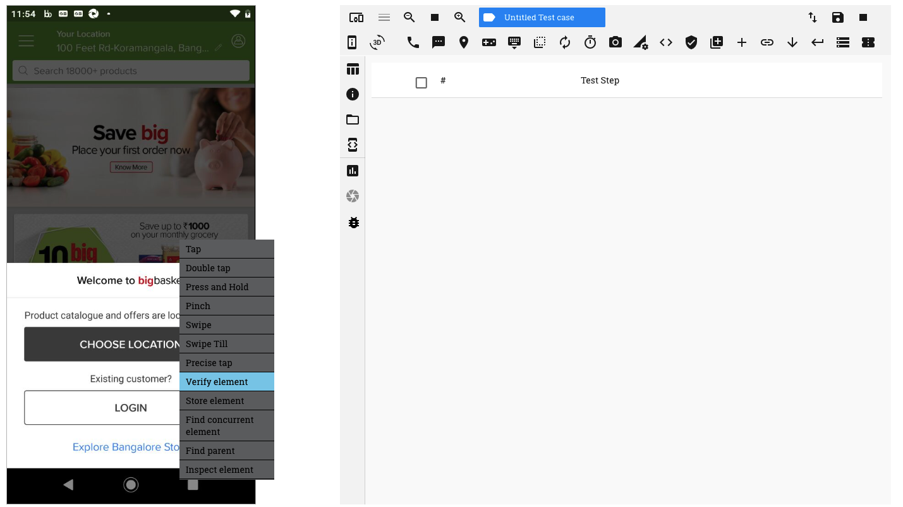
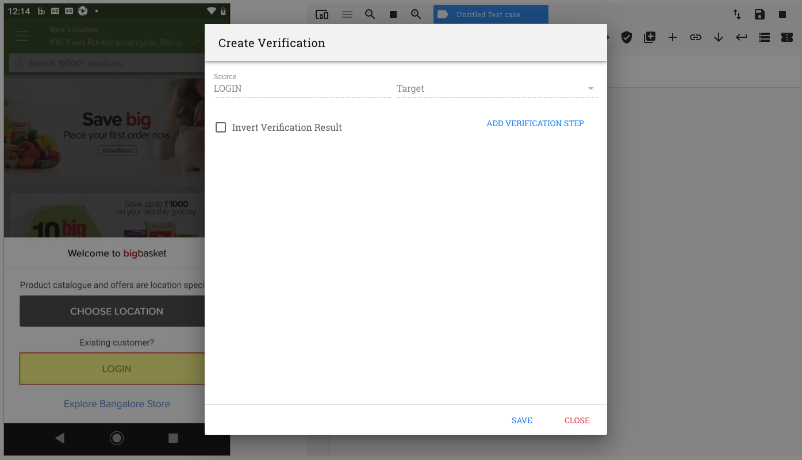

.. _verify-element:

Using the 'Verify Element' option
==========================================

.. role:: bolditalic
   :class: bolditalic

.. role:: underline
    :class: underline

   
In an Automation test session, as you move the mouse pointer over the device screen, you will see different rectangular boxes being displayed.

Each box highlights an element on the current app screen/page.

   

Hover the pointer over an element (so that a rectangle is displayed) and perform a left-click. You will see a context menu open up.

On the context menu, click on the option 'Verify Element'

You now see a 'Create Verification' window pop up

   

On this window you can see the following:-

1. Source
2. Target
3. 'Add Verification Step' button
4. 'Invert Verification Result' checkbox

We shall understand each of the above terms as we proceed further

The first step for any verification is to identify the 'Source' element

When executing a 'Verify Element' action, the 'Source' is always going to be the element on which the left-click was performed.
Hence, the 'Source' field on the top left corner of the window is disabled by default.

If the Source element has a value present for its 'text' attribute, then, this value will be displayed under 'Source'. In the example above, the element has the value 'Login' for its 'text' attribute. 

The second step is to identify a 'Target' element

This can be done in two ways:-

1. By directly using the 'Add Verification Step' button
2. By using the 'Target' drop down

**1. Directly using the 'Add Verification Step' button**
  
   The 'Add Verification Step' option is used when you want to compare the value of the Source attribute against:
   
   a. its default value populated; or; 
   b. a custom value 

   Click on the 'Add Verification Step' button. A verificaiton row is seen added

   .. image:: _static/verifyelement4.png

   On the verification row, you need to select 3 values:-

   a. the Source attribute
   b. the condition to be evaluated (or comparison criterion)
   c. the Target attribute

   **a. the Source attribute**

      On clicking on the 'Source' attribute drop down, a list of all the attributes associated with the source element, along with their values, are displayed. 

      Select the attribute whose value you want to compare by clicking on it.

      Let us click on the 'text' attribute in this example

      .. image:: _static/verifyelement5.png

     
   **b. the condition to be evaluated**

      Click on the 'Conditions' drop down. A list of various conditions can be seen.

      The conditions '*is exactly*', '*contains*' and '*is contained in*' are used for string comparisons

      The conditions '*=*', '*<*', '*>*', '*<=*' and '*>=*' are used for numeric comparisons  
     
      Select the condition to be checked by clicking on it.

      Let us click on the condition 'is exactly' in this example

      .. image:: _static/verifyelement6.png

   **c. the Target attribute**

      By default, the Target element in this case is the same as the Source element

      On clicking on the 'Target' attribute drop down, a list of all the values associated with the attributes of the element are displayed. 

      Also note that the text in this drop down is editable.

      You now have two options here:-

      1. Click on a value on the drop down. This value will be compared against the Source attribute value

                        OR

      2. Manually enter a value in the target attribute field to be compared against

      **1. Click on a value on the drop down.**

         .. image:: _static/verifyelement7.png

   
         This option can be used to ensure that the expected/default value is being displayed or populated for that attribute

         .. image:: _static/verifyelement8.png

         The above verification can be read as follows: 

         *Is the value in the text attribute of the Source element exactly the same as the value present in the Target attribute field ?*

         E.g. Is the text on the Login button exactly the same as 'Login'

      **2. Manually enter a value in the target attribute field**
            

         This option can be used to enter custom values in the target attribute field	manually           

         .. image:: _static/verifyelement9.png

**2. By using the 'Target' drop down**

   This option may be used when you want to compare the value of the Source attribute with that of a value stored in a previous test step

   The previous test step, in this case, should always be a 'Store Element' test step. Hence you need to perform a 'Store Element' action on that element.

   The details of the attribute values available for comparison may be viewed in the 'Return Data' section of the 'Store Element' test step that is recorded

   The Target element may be selected from the list of test steps displayed in the Target drop down.

   .. image:: _static/verifyelement13.png

   On clicking on the 'Add Verification Step' button. A verification row is seen

   Select the Source attribute, the comparison criterion and Target attribute from their resppective drop downs.

   .. image:: _static/verifyelement14.png

   We now have the following comparison recorded:

   .. image:: _static/verifyelement15.png

   The above verification can be read as follows: 

   *Is the value in the text attribute of the Source element exactly the same as the value present in the text attribute of the Target element ?*

   E.g. Is the item name on the product page exactly the same as the item name on the search list

   **Note:** :bolditalic:`The Target element will always be a 'Store' test step.`

