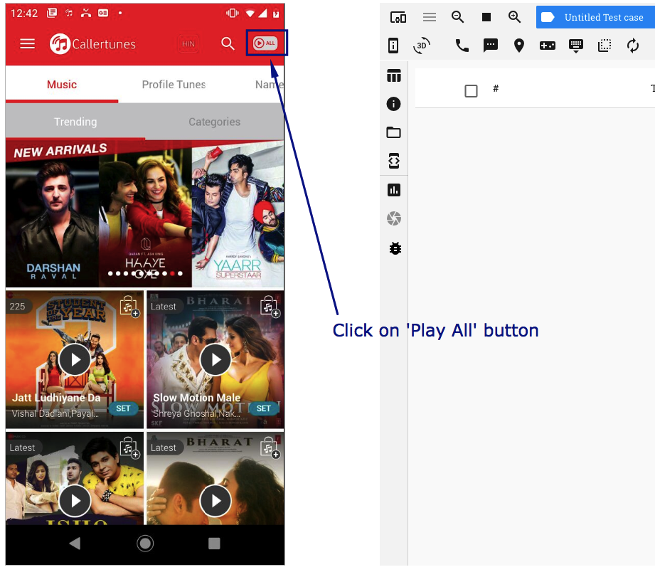
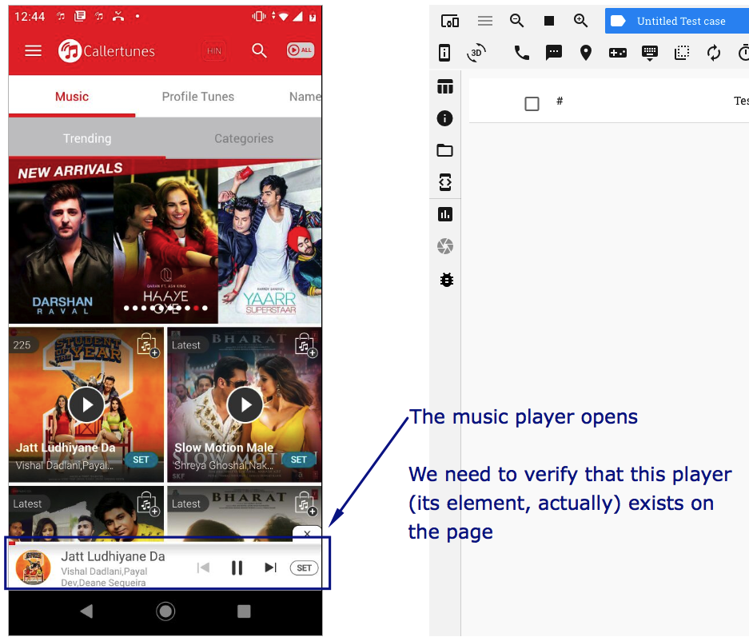
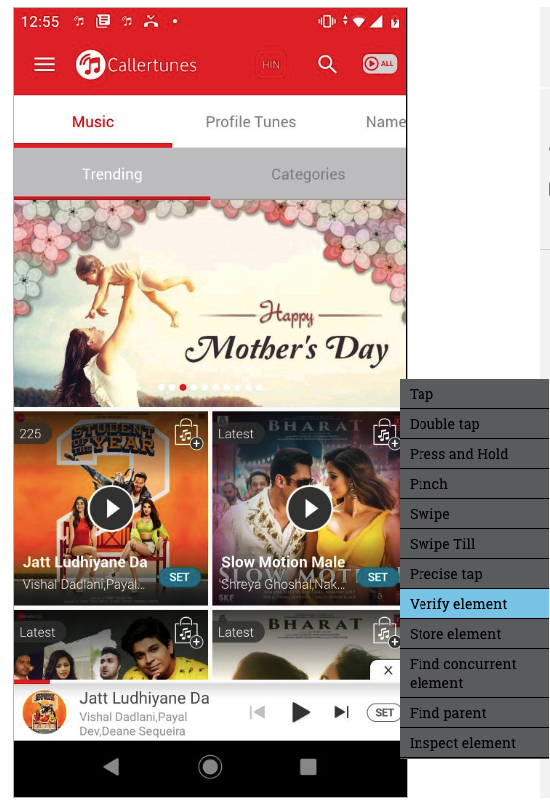
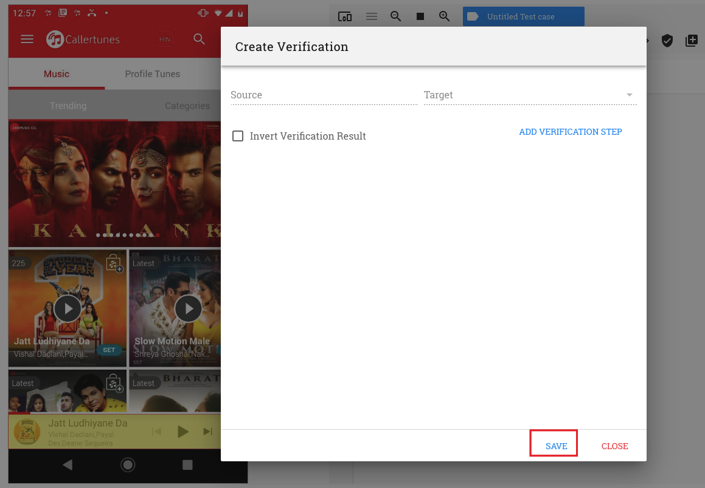

.. _verify-element-exists:

Verify that an element exists
=============================

Sometimes, you may want to just verify whether a specific element is displayed on the app page or not. This does not reqiure comparision of attribute values for verification.

E.g. say, in an app where music plays, you click on a button and a music player opens. You need to verify that the music player has opened on the page.  

In this case, all that you need to check is whether the element containing the music player is now visible on the page.

RobusTest enables you to perform this kind of a verification as follows:

1. In an Automation test session, hover the mouse on the device screen over the element which has to be verified. 

2. Left click on the element and click on 'Verify Element'

3. On the "Create Verification" window that opens, click on the 'Save' button

The verification test step that is created verifies that the element exists

